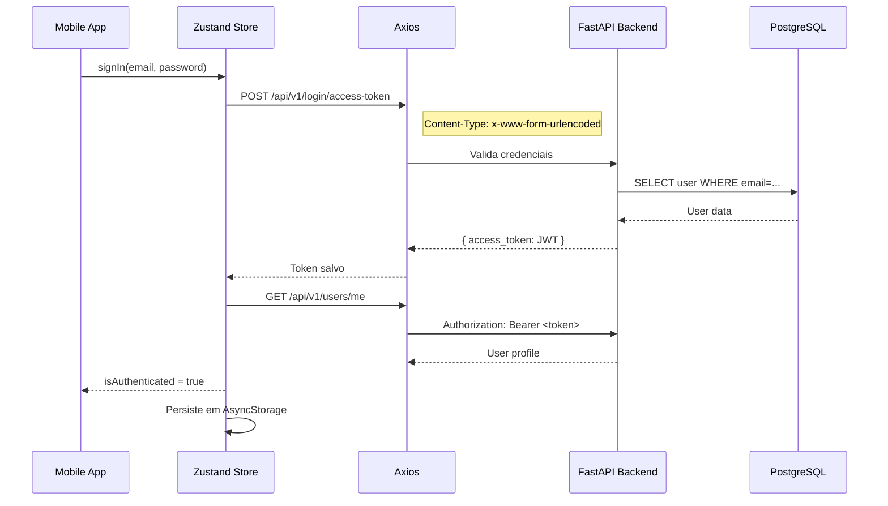
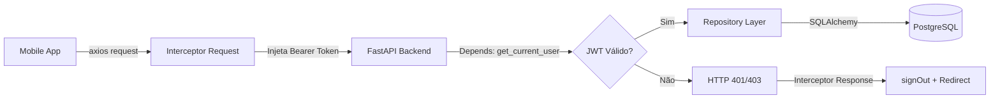
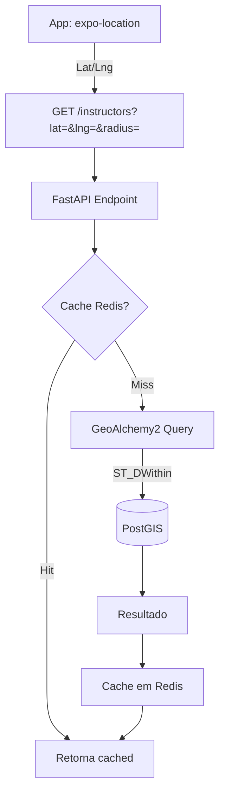
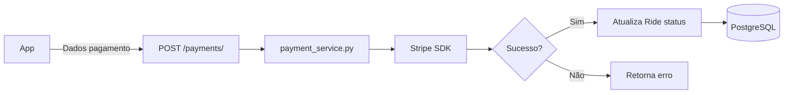

# LEGACY_MAP.md - Estado Atual do Projeto GoDrive

> **Documento de Onboarding** - Gerado em: 19/01/2026  
> **Arquiteto de Software:** Análise inicial do projeto

---

## 1. Visão Geral

O **GoDrive** é uma plataforma SaaS/Marketplace que conecta alunos interessados em tirar a CNH com instrutores credenciados independentes. O projeto é composto por dois módulos principais:

| Módulo | Diretório | Tecnologia Principal |
|--------|-----------|---------------------|
| Backend (API) | `godrive-backend/` | Python + FastAPI |
| Mobile (App) | `godrive-mobile/` | React Native + Expo |

---

## 2. Stack Tecnológica Detectada

### ⚙️ Backend

| Categoria | Tecnologia | Versão |
|-----------|------------|--------|
| Framework Web | FastAPI | 0.109.0 |
| Servidor ASGI | Uvicorn | 0.27.0 |
| Banco de Dados | PostgreSQL + PostGIS | 15-3.3 |
| ORM | SQLAlchemy | 2.0.25 |
| Extensão Geo | GeoAlchemy2 | 0.14.3 |
| Migrações | Alembic | 1.13.1 |
| Cache | Redis + fastapi-cache2 | alpine |
| Pagamentos | Stripe SDK | 8.1.0 |
| Autenticação | JWT (python-jose) | 3.3.0 |
| Validação | Pydantic | 2.5.3 |
| Containerização | Docker + Docker Compose | 3.8 |

### 📱 Mobile

| Categoria | Tecnologia | Versão |
|-----------|------------|--------|
| Framework | React Native | 0.81.5 |
| Toolkit | Expo | ~54.0.30 |
| Linguagem | TypeScript | ~5.9.2 |
| Estado Global | Zustand | ^5.0.9 |
| HTTP Client | Axios | ^1.13.2 |
| Mapas | react-native-maps | 1.20.1 |
| Navegação | React Navigation | ^7.x |
| Estilização | NativeWind (Tailwind) | ^4.2.1 |
| Persistência | AsyncStorage | 2.2.0 |
| Ícones | Lucide React Native | ^0.562.0 |

---

## 3. Estrutura de Pastas

### Backend (`godrive-backend/`)

```
godrive-backend/
├── app/
│   ├── api/
│   │   ├── deps.py              # Dependências (get_db, get_current_user)
│   │   └── v1/
│   │       ├── router.py        # Agregador de rotas
│   │       └── endpoints/       # Endpoints REST
│   │           ├── admin.py
│   │           ├── auth.py
│   │           ├── courses.py
│   │           ├── instructors.py
│   │           ├── login.py
│   │           ├── payments.py
│   │           ├── quizzes.py
│   │           ├── reviews.py
│   │           ├── rides.py
│   │           ├── users.py
│   │           └── websockets.py
│   ├── core/
│   │   └── config.py            # Settings (Pydantic + .env)
│   ├── db/
│   │   ├── base.py              # Base SQLAlchemy
│   │   └── session.py           # Engine + SessionLocal
│   ├── models/                  # Modelos SQLAlchemy (ORM)
│   │   ├── user.py
│   │   ├── instructor.py
│   │   ├── availability.py
│   │   ├── ride.py
│   │   ├── review.py
│   │   ├── course.py
│   │   └── quiz.py
│   ├── repositories/            # Padrão Repository (DAL)
│   ├── schemas/                 # Pydantic Schemas (DTOs)
│   ├── services/                # Lógica de Negócio
│   │   ├── auth_service.py
│   │   ├── availability_service.py
│   │   ├── payment_service.py
│   │   ├── quiz_service.py
│   │   ├── socket_service.py
│   │   └── user_service.py
│   ├── utils/
│   └── main.py                  # Entry point FastAPI
├── migrations/                  # Alembic migrations
├── uploads/                     # Arquivos uploaded
├── Dockerfile
├── docker-compose.yml
├── requirements.txt
└── alembic.ini
```

### Mobile (`godrive-mobile/`)

```
godrive-mobile/
├── src/
│   ├── @types/                  # Tipos TypeScript customizados
│   ├── assets/                  # Imagens e recursos
│   ├── components/              # Componentes reutilizáveis
│   ├── config/
│   │   └── env.ts               # Configuração de ambiente
│   ├── hooks/                   # React Hooks customizados
│   ├── routes/                  # Navegação
│   │   ├── AppNavigator.tsx     # Navegador principal
│   │   ├── AppTabs.tsx          # Bottom tabs
│   │   ├── AuthStack.tsx        # Stack de autenticação
│   │   ├── InstructorStack.tsx  # Fluxo do instrutor
│   │   └── StudentStack.tsx     # Fluxo do aluno
│   ├── screens/                 # Telas
│   │   ├── auth/                # Login, Register
│   │   ├── courses/             # Módulo LMS
│   │   ├── instructor/          # Área do instrutor
│   │   ├── ride/                # Aulas/corridas
│   │   └── student/             # Área do aluno
│   ├── services/                # Camada de API
│   │   ├── api.ts               # Instância Axios configurada
│   │   ├── auth.service.ts
│   │   ├── instructorService.ts
│   │   ├── ride.service.ts
│   │   ├── socket.service.ts
│   │   └── user.service.ts
│   ├── stores/                  # Estado global (Zustand)
│   │   ├── useAuthStore.ts      # Autenticação
│   │   └── useRideStore.ts      # Aulas
│   ├── types/                   # Interfaces TypeScript
│   └── utils/                   # Funções utilitárias
├── App.tsx                      # Entry point
├── package.json
├── tailwind.config.js
└── tsconfig.json
```

---

## 4. Fluxos de Dados Principais

### 4.1 Fluxo de Autenticação



### 4.2 Fluxo de Requisição Autenticada



### 4.3 Fluxo de Busca Georreferenciada (Instrutores)



### 4.4 Fluxo de Pagamentos



### 4.5 Fluxo Real-Time (WebSocket)

```mermaid
flowchart TB
    A[Mobile: socket.service.ts] -->|WS Connect| B[/ws/ride/{ride_id}]
    B --> C[socket_service.py]
    C --> D[Telemetria GPS]
    D -->|5s movimento / 30s parado| A
```

---

## 5. Modelos de Dados (Entidades)

| Modelo | Descrição | Relacionamentos |
|--------|-----------|-----------------|
| `User` | Usuário base (aluno ou instrutor) | 1:1 → InstructorProfile |
| `InstructorProfile` | Perfil específico do instrutor | N:1 → User |
| `Availability` | Disponibilidade do instrutor | N:1 → InstructorProfile |
| `Ride` | Aula agendada/realizada | N:1 → User (aluno), N:1 → Instructor |
| `Review` | Avaliação bilateral | N:1 → Ride |
| `Course` | Curso teórico (LMS) | 1:N → Module |
| `Module` | Módulo do curso | 1:N → Lesson |
| `Lesson` | Aula/vídeo do módulo | - |
| `Enrollment` | Matrícula em curso | N:1 → User, N:1 → Course |
| `Quiz` | Simulado DETRAN | 1:N → Question |
| `Question` | Pergunta do quiz | 1:N → QuestionOption |
| `UserQuizAttempt` | Tentativa de quiz | N:1 → User, N:1 → Quiz |

---

## 6. Endpoints da API (v1)

| Prefixo | Arquivo | Descrição |
|---------|---------|-----------|
| `/login` | `login.py` | Autenticação OAuth2 |
| `/users` | `users.py` | CRUD usuários |
| `/instructors` | `instructors.py` | Busca geo, perfil instrutor |
| `/rides` | `rides.py` | Agendamento, status aulas |
| `/payments` | `payments.py` | Stripe, carteira digital |
| `/ws` | `websockets.py` | Telemetria real-time |
| `/admin` | `admin.py` | Backoffice |
| `/reviews` | `reviews.py` | Avaliações |
| `/courses` | `courses.py` | LMS (cursos, módulos) |
| `/quizzes` | `quizzes.py` | Simulados DETRAN |

---

## 7. Infraestrutura Docker

```yaml
services:
  db:        # PostgreSQL 15 + PostGIS 3.3
  redis:     # Redis Alpine (cache)
  backend:   # FastAPI + Uvicorn (porta 8000)
```

**Dependências de inicialização:** `backend` → `db` + `redis`

---

## 8. Patterns Identificados

| Pattern | Localização | Descrição |
|---------|-------------|-----------|
| **Repository Pattern** | `app/repositories/` | Abstração de acesso a dados |
| **Service Layer** | `app/services/` | Lógica de negócio isolada |
| **Dependency Injection** | `app/api/deps.py` | FastAPI `Depends()` |
| **DTO/Schema** | `app/schemas/` | Pydantic models para validação |
| **Store Pattern** | `src/stores/` | Zustand com persistência |
| **Interceptors** | `api.ts` | Injeção de token + tratamento 401 |

---

## 9. Observações para Próximos Passos

> [!NOTE]
> Este documento representa uma **fotografia** do estado atual. Nenhuma alteração foi feita no código.

### Pontos de Atenção

1. **Stripe placeholders** - As chaves no `docker-compose.yml` são placeholders (`sk_test_placeholder`)
2. **Migrações** - Diretório `migrations/` com Alembic configurado
3. **Uploads** - Pasta `uploads/` para arquivos (CNH, documentos veículo)
4. **Tipos Mobile** - Diretório `@types/` e `types/` para tipagem TypeScript

### Próximas Análises Sugeridas

- [ ] Mapear migrações Alembic existentes
- [ ] Analisar cobertura de testes (se existente)
- [ ] Revisar schemas Pydantic vs modelos SQLAlchemy
- [ ] Auditar segurança (CORS, rate limiting, etc.)
