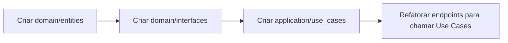

# REFACTOR_PLAN.md - Análise de Gaps Arquiteturais

> **Comparação:** PROJECT_GUIDELINES.md (Estado Ideal) × LEGACY_MAP.md (Estado Atual)  
> **Data:** 19/01/2026

---

## Sumário Executivo

| Área | Estado Ideal | Estado Atual | Gap Crítico? |
|------|-------------|--------------|--------------|
| Backend - Clean Architecture | domain/ application/ infrastructure/ interface/ | app/ com camadas misturadas | ⚠️ **SIM** |
| Mobile - Feature-Based | features/ shared/ lib/ | screens/, services/, stores/ (por tipo) | ⚠️ **SIM** |
| TanStack Query | Obrigatório para cache servidor | Não implementado | ⚠️ **SIM** |

---

## 1. Violações Clean Architecture no Backend

### 1.1 Estrutura de Pastas Incorreta

**Ideal (Guidelines):**
```
backend/src/
├── domain/            # Entidades puras + Interfaces
├── application/       # Casos de Uso
├── infrastructure/    # SQLAlchemy, Stripe, etc.
└── interface/         # FastAPI routers
```

**Atual (Legacy):**
```
godrive-backend/app/
├── api/               # ❌ Contém lógica de negócio
├── models/            # ❌ SQLAlchemy acoplado (não é "domain")
├── repositories/      # ✓ Existe, mas implementa tudo junto
├── schemas/           # ✓ Pydantic (mas mistura DTO com Domain)
├── services/          # ⚠️ Lógica de negócio, mas chama infra diretamente
└── core/              # Config apenas
```

> [!CAUTION]
> **Não existem as camadas `domain/` e `application/`** - toda a lógica de negócio está dispersa entre `api/endpoints/` e `services/`.

---

### 1.2 Lógica de Negócio nos Controllers (Alta Severidade)

**Arquivo:** `app/api/v1/endpoints/instructors.py`

```python
# VIOLAÇÃO: Lógica de negócio diretamente no endpoint
@router.post("/", response_model=InstructorResponse)
def create_instructor_profile(...):
    # ❌ Query SQLAlchemy direta no controller
    existing = db.query(InstructorProfile).filter_by(id=current_user.id).first()
    
    # ❌ Regra de negócio no controller
    if current_user.user_type != "instructor":
        current_user.user_type = "instructor"
        db.add(current_user)
        db.commit()
```

**Arquivo:** `app/api/v1/endpoints/rides.py`

```python
# VIOLAÇÃO: Validações de negócio e queries no controller
@router.post("/", ...)
def create_ride(...):
    # ❌ Validação temporal no controller
    if ride_in.scheduled_at < now:
        raise HTTPException(...)
    
    # ❌ Query direta no controller
    instructor = db.query(InstructorProfile).filter(...).first()
    
    # ❌ Cálculo de preço no controller
    price = instructor.hourly_rate if instructor.hourly_rate else 0.0
```

**Correção Requerida:**
- Mover validações para `application/use_cases/criar_agendamento.py`
- Controller deve apenas: receber request → chamar use case → retornar response

---

### 1.3 Models SQLAlchemy Expostos como Domain (Média Severidade)

**Problema:** `app/models/` contém entidades SQLAlchemy, não entidades de domínio puras.

```python
# app/models/user.py - ATUAL (Acoplado ao SQLAlchemy)
from sqlalchemy import Column, Integer, String
from app.db.base import Base

class User(Base):  # ❌ Herda de Base (SQLAlchemy)
    __tablename__ = "users"
    id = Column(Integer, primary_key=True)
```

**Correção Requerida:**
```python
# domain/entities/user.py - IDEAL (Puro)
from dataclasses import dataclass

@dataclass
class User:
    id: int
    full_name: str
    email: str
    user_type: str
```

---

### 1.4 Ausência de Interfaces/Protocolos (Média Severidade)

**Problema:** Repositories são implementações concretas sem abstração.

```python
# ATUAL: Implementação direta
class InstructorRepository:
    def get_by_radius(self, db: Session, ...):
        # Implementação SQLAlchemy
```

**Ideal:** Protocol para inversão de dependência

```python
# domain/interfaces/instructor_repository.py
from typing import Protocol

class IInstructorRepository(Protocol):
    def get_by_radius(self, lat: float, lng: float, radius: float) -> list[Instructor]:
        ...
```

---

### 1.5 Exceções HTTP em Camadas Internas (Baixa Severidade)

**Problema:** `HTTPException` usada em serviços e repositories.

```python
# app/services/availability_service.py
from fastapi import HTTPException  # ❌ FastAPI em camada de serviço
```

**Correção:** Usar exceções de domínio customizadas:
```python
# domain/exceptions.py
class InstructorNotFoundException(Exception): ...
class SlotNotAvailableException(Exception): ...
```

---

## 2. Violações Feature-Based no Mobile

### 2.1 Estrutura por Tipo Técnico (em vez de Feature)

**Ideal (Guidelines):**
```
mobile/src/
├── features/
│   ├── auth/
│   │   ├── components/
│   │   ├── hooks/
│   │   └── api/
│   ├── map/
│   └── scheduling/
├── shared/
└── lib/
```

**Atual (Legacy):**
```
godrive-mobile/src/
├── screens/           # ❌ Organizado por tipo, não feature
│   ├── auth/
│   ├── courses/
│   ├── instructor/
│   ├── ride/
│   └── student/
├── services/          # ❌ Global, não feature-scoped
├── stores/            # ❌ Global stores
├── hooks/             # ❌ Global hooks
├── components/        # ❌ Global components
└── types/             # ❌ Global types
```

> [!WARNING]
> A estrutura atual dificulta isolamento de features e aumenta acoplamento entre módulos.

---

### 2.2 TanStack Query Não Implementado (Alta Severidade)

**Guideline:**
> "TanStack Query (React Query) v5+ (Obrigatório para cache e requisições)"

**Atual:**
- `package.json` **não contém** `@tanstack/react-query`
- Estado do servidor gerenciado manualmente via Zustand + useEffect
- Sem cache automático, refetch, stale-while-revalidate

**Exemplo de código problemático:**
```typescript
// stores/useAuthStore.ts - Gerenciando server state manualmente
const signIn = async ({ username, password }) => {
  set({ isLoading: true }); // ❌ Loading state manual
  const { data } = await api.post('/login/...');
  // ❌ Sem cache, sem retry automático
};
```

---

### 2.3 Componentes sem Shared Layer

**Problema:** Não existe diretório `shared/` para componentes reutilizáveis.

**Atual:** `src/components/` (genérico)  
**Ideal:** `src/shared/components/` + componentes específicos em cada `features/X/components/`

---

## 3. Priorização de Refatoração

### Matriz de Impacto × Esforço

| Prioridade | Mudança | Impacto | Esforço | Justificativa |
|:----------:|---------|:-------:|:-------:|---------------|
| 🔴 **P0** | Criar camada `domain/` + `application/` | Alto | Alto | Bloqueia SOLID, dificulta testes |
| 🔴 **P0** | Implementar TanStack Query no Mobile | Alto | Médio | Performance, UX, cache servidor |
| 🟠 **P1** | Refatorar endpoints → Use Cases | Alto | Médio | Lógica de negócio espalhada |
| 🟠 **P1** | Migrar Mobile para Feature-Based | Médio | Alto | Isolamento e escalabilidade |
| 🟡 **P2** | Criar Interfaces/Protocols | Médio | Baixo | Inversão de dependência |
| 🟡 **P2** | Exceções de Domínio | Baixo | Baixo | Separação de concerns |
| 🟢 **P3** | Criar `shared/` no Mobile | Baixo | Baixo | Organização |

---

## 4. Roadmap de Refatoração Sugerido

### Fase 1: Foundation (Crítico antes de novas features)



**Backend - Sprint 1-2:**
1. Criar `domain/entities/` com dataclasses puras
2. Criar `domain/interfaces/` com Protocols
3. Criar primeiro Use Case: `application/use_cases/criar_agendamento.py`
4. Refatorar `rides.py` endpoint para usar o Use Case

**Mobile - Sprint 1-2:**
1. Instalar `@tanstack/react-query`
2. Criar `src/lib/queryClient.ts`
3. Migrar `useAuthStore` para usar React Query (mutations)
4. Refatorar busca de instrutores para useQuery

---

### Fase 2: Structural Reorganization

**Backend - Sprint 3:**
1. Mover `app/models/` → `infrastructure/db/models/`
2. Mover `app/repositories/` → `infrastructure/repositories/`
3. Mover `app/api/` → `interface/api/`

**Mobile - Sprint 3-4:**
1. Criar estrutura `features/auth/`, `features/scheduling/`
2. Migrar screens, hooks e services para dentro de cada feature
3. Criar `shared/components/` para componentes globais

---

### Fase 3: Polish

**Sprint 5:**
1. Criar exceções de domínio customizadas
2. Implementar mappers: Entity ↔ SQLAlchemy Model ↔ Pydantic Schema
3. Adicionar testes unitários para Use Cases

---

## 5. Checklist de Compliance

### Backend - Clean Architecture

- [ ] Existe `domain/entities/` com classes puras (sem SQLAlchemy)
- [ ] Existe `domain/interfaces/` com Protocols
- [ ] Existe `application/use_cases/` com regras de negócio
- [ ] Controllers apenas delegam para Use Cases
- [ ] Nenhum import de `sqlalchemy` fora de `infrastructure/`
- [ ] Nenhum import de `fastapi` fora de `interface/`

### Mobile - Feature-Based + React Query

- [ ] TanStack Query instalado e configurado
- [ ] Diretório `features/` com módulos isolados
- [ ] Cada feature tem seus próprios `components/`, `hooks/`, `api/`
- [ ] `shared/` para componentes globais
- [ ] `lib/` para configurações (queryClient, axios, zustand)
- [ ] Server state gerenciado com React Query (não Zustand)

---

## 6. Riscos de Não Refatorar

| Risco | Consequência | Probabilidade |
|-------|--------------|---------------|
| Lógica duplicada | Bugs em regras de negócio (ex: cancelamento) | Alta |
| Testes difíceis | Baixa cobertura, regressões | Alta |
| Acoplamento forte | Mudanças em cascata, deploys arriscados | Média |
| Performance Mobile | Requisições duplicadas, UX lenta | Alta |
| Onboarding lento | Novos devs demoram a entender | Média |

---

> [!IMPORTANT]
> **Recomendação:** Não iniciar novas features complexas (ex: Chat, VoIP) antes de completar a **Fase 1** do refactor. O débito técnico atual aumentará exponencialmente com mais código.
